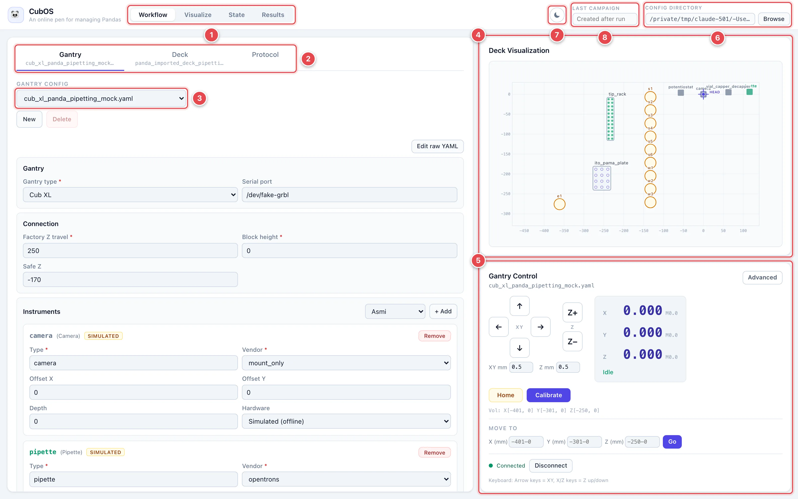

# Use CubOS Operator

CubOS Operator lets you set up labware, move the gantry (the moving machine
head), run a protocol (a saved list of steps), and download measurements.
Use it in the installed CubOS app or a web browser.

## Open CubOS

| Your setup | What to do |
|---|---|
| Windows with CubOS installed | Open **CubOS** from the desktop or Start menu. Closing the app stops its local server. |
| Preinstalled lab computer or appliance | Open the address your administrator supplied. On the CubOS computer, the default is `http://127.0.0.1:8742`. |
| Installing from source | Follow [Getting Started](getting-started.md#installation), then start `python -m cubos_api` with the virtual environment active. Keep that terminal open. |
| Raspberry Pi or remote computer | Ask your administrator for access, or follow [Connect to a Raspberry Pi](#connect-to-a-raspberry-pi). |

## Your First Run

Follow these pages in order. For a machine already set up, use your lab's
saved files and calibration.

| Step | What you do |
|---|---|
| 1. [Gantry](operator-ui/gantry.md) | Open the machine's settings file, connect, and home. |
| 2. [Calibrate the Gantry](operator-ui/calibrate-gantry.md) | Set the machine's reference position when first installed or after a mechanical change. |
| 3. [Deck and Labware](operator-ui/deck-and-labware.md) | Describe the plates, vials, and racks on the deck and record their positions. |
| 4. [Protocols](operator-ui/protocols.md) | Open or build the steps, save, validate, and run. |
| 5. [Results and State](operator-ui/results-and-state.md) | Download measurements and check recorded liquid, tip, and cap state. |

A **config** is a settings file. CubOS uses three: **Gantry** for the machine
and instruments, **Deck** for labware, and **Protocol** for the steps to run.
You can edit them using the forms; editing file text is optional.

Screenshots use numbered callouts explained directly below each image.
Example filenames and instruments will differ from your lab's setup.

## A Tour of the Screen



1. **View switcher.** **Workflow** edits settings, **Visualize** enlarges
   the deck map, **State** shows liquid/tips/caps, and **Results** shows
   measurements. **Run** appears once a run exists.
2. **Editor tabs.** **Gantry**, **Deck**, and **Protocol** edit the three
   settings files. An amber dot marks unsaved edits. Protocol needs a saved gantry and deck.
3. **Config picker.** Opens a saved file; **New** starts a draft and
   **Delete** removes the selected file after confirmation.
4. **Deck Visualization.** Map of saved or edited labware positions. The
   **HEAD** crosshair follows the gantry position.
5. **Gantry Control.** Connect, home, jog, move to coordinates, and calibrate.
6. **Config Directory.** Where CubOS reads and saves files. **Browse** chooses
   another folder. On a remote setup, this is a folder on the CubOS computer,
   not your laptop; enter its path if the folder chooser cannot open.
7. **Theme toggle.** Switches light/dark mode.
8. **Last Campaign.** The most recent successful run's campaign number;
   find its measurements in Results.

The deck map and movement controls stay on the right as you switch views.

## Save Before You Run

Protocol runs always use the **saved** gantry, deck, and protocol files, not
whatever is on screen. Every editor shows an amber **Unsaved changes** banner
and an amber dot on its tab while edits are pending. **Run Protocol** refuses
to start until you save or discard them, and **Validate** does the same.
`Ctrl+S` / `Cmd+S` saves the active editor.

## If Something Goes Wrong

| Problem | First check |
|---|---|
| **Select config first** | Open a gantry file. |
| Connection fails | Check power, USB, and that another gantry app is not using the port. |
| **ALARM**, **HOLD**, or blocked movement | Follow [Gantry recovery](operator-ui/gantry.md#if-movement-is-blocked). |
| Validation fails | Read the reported step and target; check its saved settings and heights. |
| Map differs from the bench | Check labware positions and recalibrate items that moved. |

See [Troubleshooting & Recovery](troubleshooting.md) for detailed steps.

## Update CubOS

On appliances with updating enabled, an **Update available** banner appears
when a newer release is found. Save your work and finish or cancel any run,
then click **Update & restart** and confirm. Wait for the page to reload.
If the update reports an error or takes longer than expected, ask your
administrator to check it. See the [Pi update guide](https://github.com/Ursa-Laboratories/CubOS/blob/main/deploy/pi/README.md).

## Connect to a Raspberry Pi

If your administrator has set up SSH access, run this on your laptop,
replacing the login and address:

```bash
ssh -L 8742:127.0.0.1:8742 <user>@<pi-address>
```

Open `http://127.0.0.1:8742` on your laptop. Keep the SSH window open and
CubOS running on the Pi. Closing the tunnel removes browser access; it does
not stop a protocol. Stay within reach of the machine's emergency stop.
