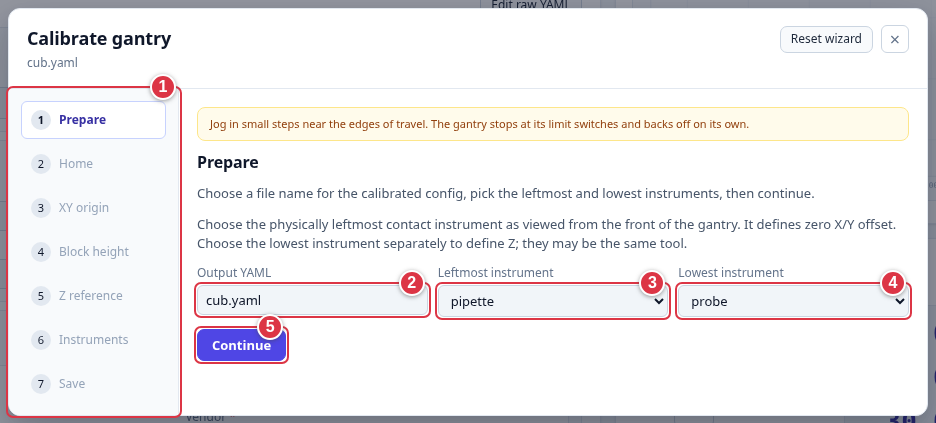
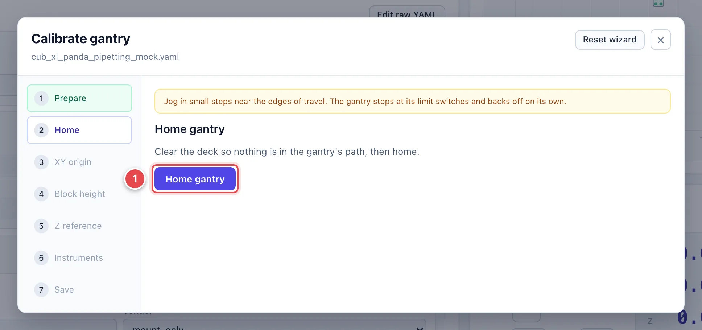
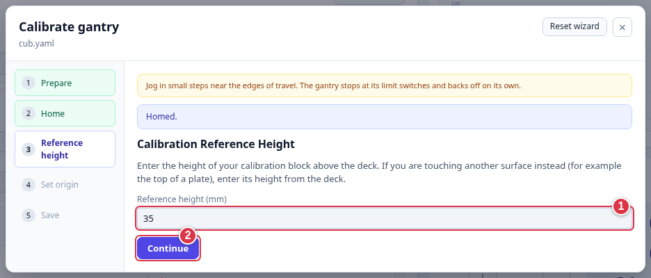
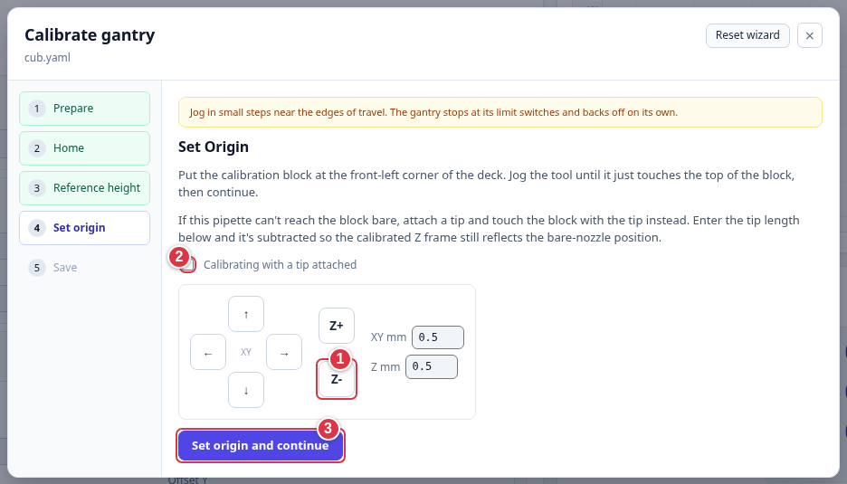
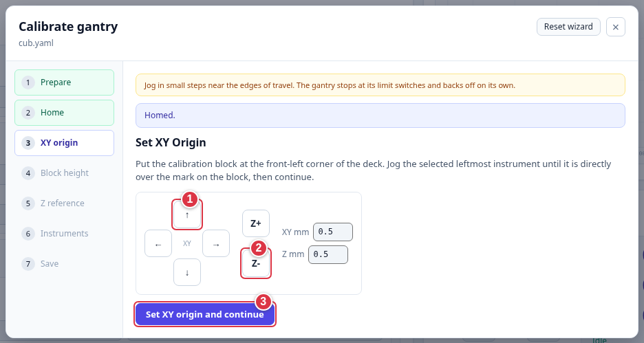
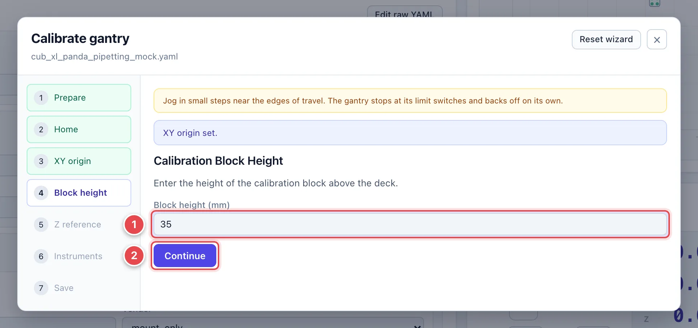
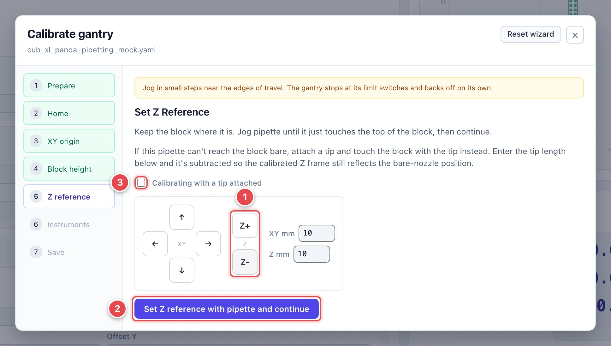
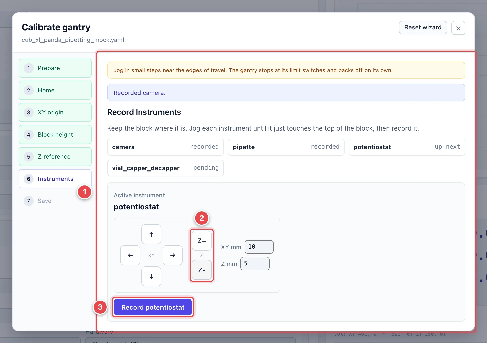
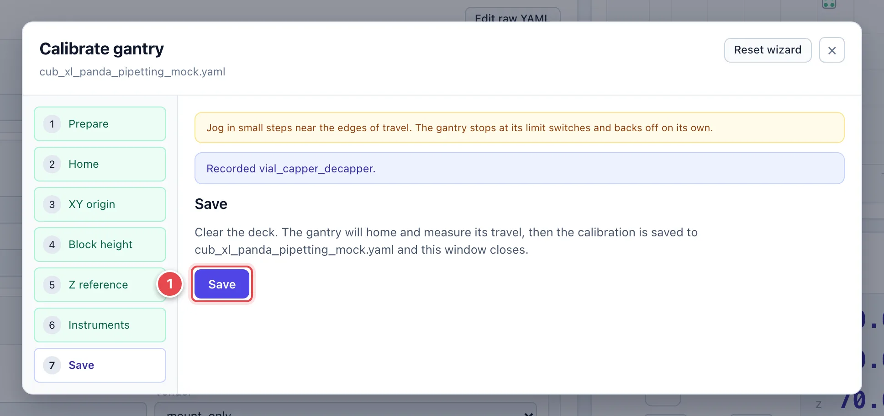

# Calibrate the Gantry

Calibration tells CubOS where the deck is and where each instrument's tip
sits relative to the moving head. Do this at first setup, after a crash or
mechanical change, or when saved positions no longer match the machine.

Open your **Gantry** settings, add and save the mounted instruments, then
click **Calibrate** in Gantry Control. Have a calibration block of known
height ready. The wizard connects and homes the gantry in its **Home** step.

!!! warning "Calibration moves hardware"
    Clear the motion path and keep the emergency stop within reach. Software
    travel limits are disabled during calibration. Use small jog steps near
    tools, labware, and the frame; limit switches do not detect collisions.

## Prepare and Home

1. **Step list.** Seven steps for multiple instruments; five for one.
2. **Output YAML.** The settings file to save. Use a new filename to keep
   your original file.
3. **Leftmost instrument.** On a multi-instrument machine, choose the
   contact tool furthest left **as you face the machine**. It sets the X/Y
   reference. A camera cannot be this contact reference.
4. **Lowest instrument.** Choose the contact tool that reaches furthest
   down. It sets the Z reference. This can be the same as the leftmost tool.
5. **Continue.** Goes to Home.

Clear the deck, then click **Home gantry**. Wait for the next step.

## One Instrument

The wizard follows **Prepare → Home → Reference height → Set origin → Save**.

1. **Reference height (mm).** Enter the block's height above the deck.
   If touching another reference surface, enter that surface's height.
2. **Continue.** Goes to Set origin.

Place the block at the corner named in the wizard: **front-left** for
`deck_origin` (the default), **back-right** for `home_origin`.

1. **Jog controls.** Align the tool with the reference mark and lower it
   until it just touches the block. Use about 0.1 mm steps for the final
   approach; never force a tool into the surface.
2. **Calibrating with a tip attached.** For a pipette, tick this if using a
   tip and enter its length. CubOS accounts for it when recording the bare
   nozzle's position.
3. **Set origin and continue.** Records the position, then goes to
   [Save](#save).

## Multiple Instruments

### Set the XY origin

Place the block at the corner named in the wizard: **front-left** for
`deck_origin`, **back-right** for `home_origin`.

1. **XY jog pad.** Align the selected **leftmost instrument** over the mark.
2. **Z jog.** Lower enough to check alignment, keeping clear of the block.
3. **Set XY origin and continue.** Records the horizontal reference.

### Enter the block height

Enter the block's height above the deck in millimeters, then **Continue**.
This lets CubOS place Z zero at the deck surface.

### Set the Z reference

Keep the block in place.

1. **Z jog.** Bring the **lowest instrument** just into contact with the
   block. Use about 0.1 mm steps for the final approach.
2. **Set Z reference … and continue.** Records the touch position. The
   head must have moved below its homed height.
3. **Calibrating with a tip attached.** If touching with a pipette tip,
   tick this and enter the tip length.

### Record the other instruments

1. **Instrument status.** Shows which tools are recorded and which is next.
   The lowest tool was already recorded in the Z-reference step.
2. **Jog controls.** Align each requested tool with the **same mark** and
   bring it just into contact with the block.
3. **Record …** Saves that tool's position and advances to the next.

For a **camera**, center the preview crosshair on the mark and enter
**Distance from calibration block (mm)**; do not touch the block with the
camera. A mount-only camera may have no live preview. Tools configured to
follow the camera are calibrated with it automatically.

## Save

Clear the deck and click **Save**. The gantry homes and measures its travel
before writing the calibrated file. Wait for the window to close and the
saved travel ranges to appear in Gantry Control. A new output filename
becomes the selected gantry file.

**Reset wizard** starts over. **×** closes without saving the calibration.
If **CALIBRATION INTERRUPTED** appears, use **Restore soft limits** before
running a protocol; reconnect if restoration fails.

Next, [calibrate the labware](deck-and-labware.md). For reference heights
and coordinate details, see [Calibrate Gantry](../calibration.md).
