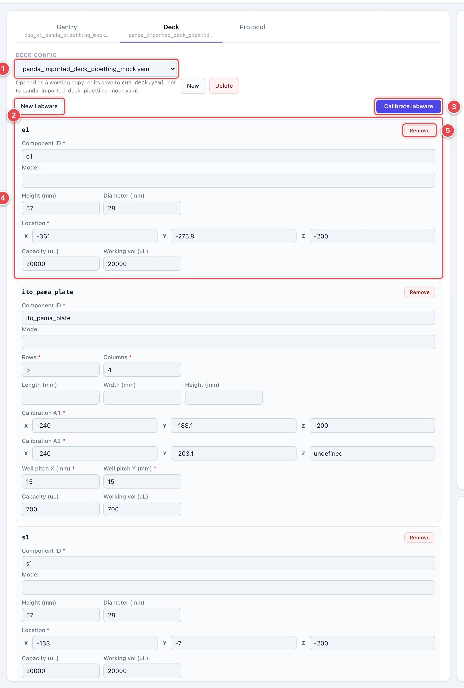
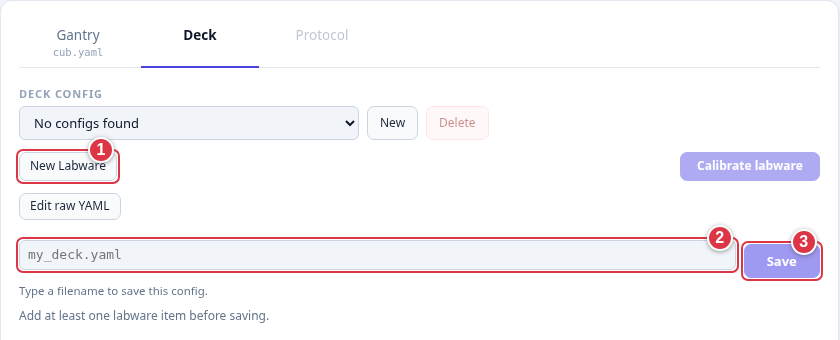
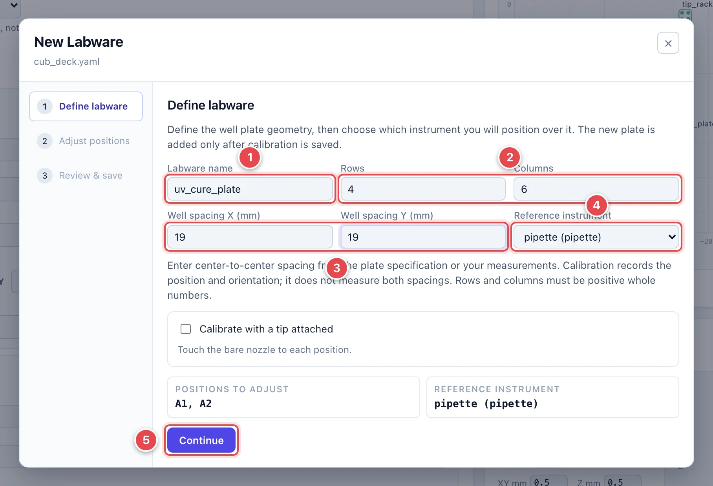
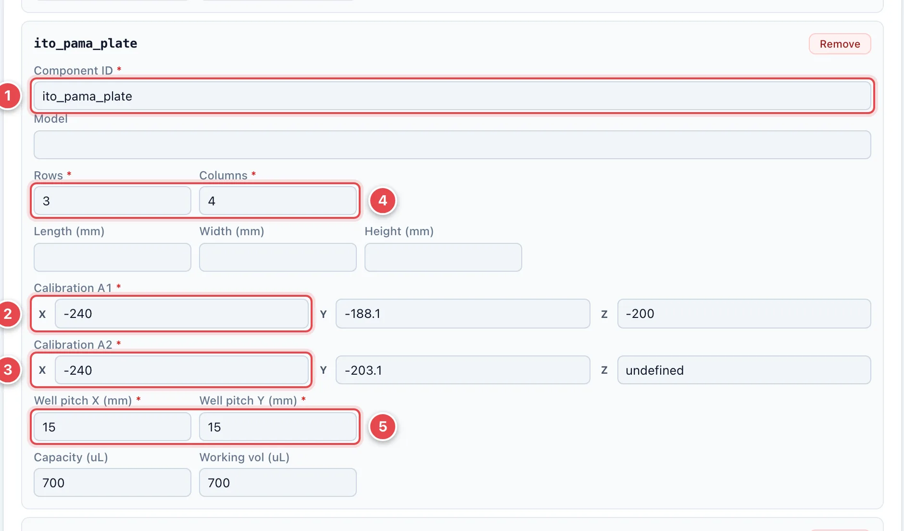
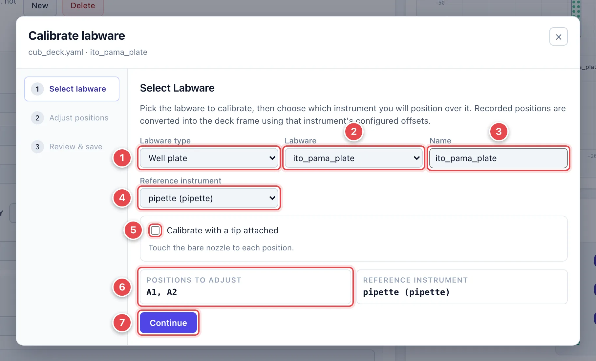
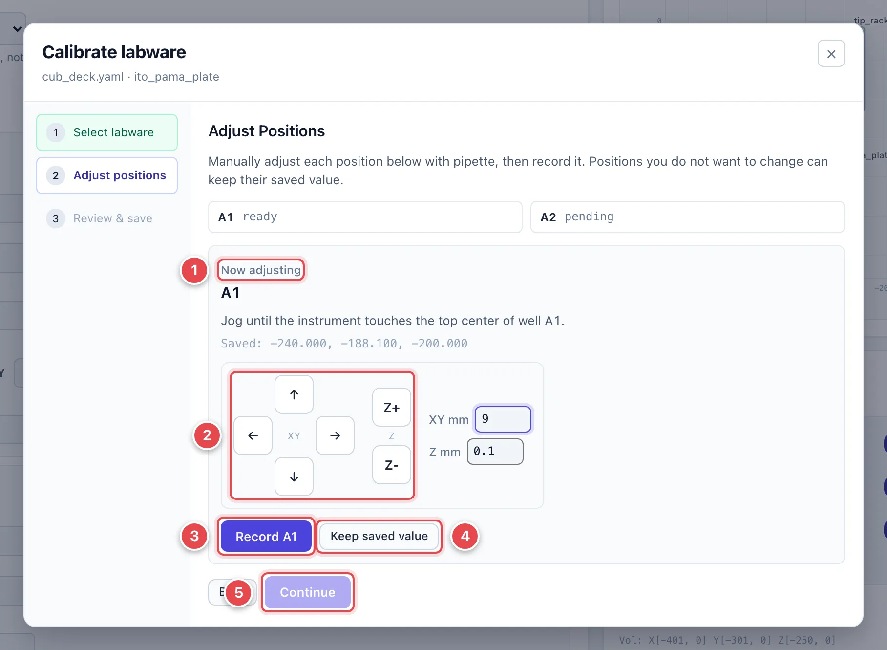
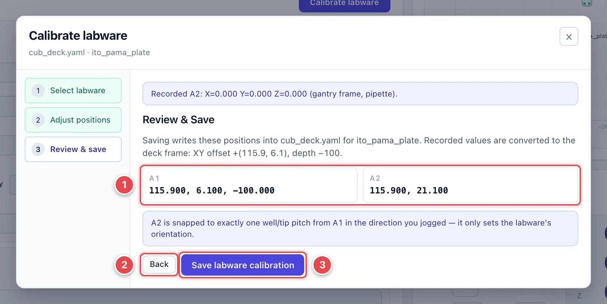

# Deck and Labware

The **Deck** file describes your plates, vials, and racks and their positions.
Before recording positions, [calibrate the gantry](calibrate-gantry.md),
connect, and home. Secure labware so it cannot shift. Raise the tool clear
of labware before moving sideways.

## The Deck Tab

1. **Deck config.** Opens a working copy in `cub_deck.yaml`; the selected
   source file is kept. The note below the picker shows where edits go.
2. **New Labware.** Creates a custom well plate.
3. **Calibrate labware.** Records positions for existing labware or a
   built-in template. Requires a gantry and a deck containing labware;
   unavailable during a run.
4. **Labware card.** Settings for each item; fields depend on its type.
5. **Remove.** Removes the item from the working copy.

Vial grids, tip racks, tip disposals, and holders have their own fields.
Unsupported types are kept when saving; use **Edit raw YAML** for their settings.

## Create Custom Labware

Load a gantry config, then click **New Labware**. You can start without a deck file.

1. **New Labware.** Opens Define labware.
2. **Filename.** After adding the first plate, enter a name such as `my_deck.yaml`.
3. **Save.** Keeps the new deck. With a selected deck, the dialog saves directly.

1. **Labware name.** A unique name; CubOS creates an ID for addressing wells,
   such as `my_plate.A1`. Check the resulting card's **Component ID**.
2. **Rows / Columns.** Positive whole numbers describing the grid.
3. **Well spacing X / Y (mm).** Positive center-to-center distances from
   the plate specification or your measurements. Calibration does not measure spacing.
4. **Reference instrument.** The tool you will align with the plate;
   selected automatically for a single-instrument setup.
5. **Continue.** Goes to [Adjust positions](#2-adjust-positions).

For a pipette with a tip attached, tick **Calibrate with a tip attached** and
enter the tip length. Finish recording and saving below; closing early
cancels creation. Other labware and your current deck edits are kept.

For a one-column plate, A2 marks the direction a second column would occupy;
it does not add an extra well.

## Check and Save the Deck

1. **Component ID.** The identifier protocols use: `plate.A1`, `plate.B2`, etc.
2. **Calibration A1.** Center of the first well at the reference surface.
3. **Calibration A2.** Next well along the row; determines orientation.
4. **Rows / Columns.** The grid size.
5. **Well pitch X / Y.** Center-to-center spacing; 9 mm for a standard 96-well SBS plate.

Use the calibration dialog to record coordinates. It accounts for the
selected tool's offset; copying the head's readout directly can misplace the tool.

1. **Filename.** Defaults to the working copy; change it to save another file.
2. **Save.** Writes the deck and updates the map.

**Unsaved changes** means your edits are still a draft. Save before running.
Check the map against the bench; it cannot detect shifted labware.
Recalibrate any item you move.

## Calibrate Labware with the Gantry

Click **Calibrate labware** in the Deck tab.

### 1. Select labware

1. **Labware type.** Choose plate, vial, grid, rack, disposal, or holder.
2. **Labware.** Pick an existing item or **Add new** from a built-in template.
3. **Name.** The display name for the item.
4. **Reference instrument.** Choose the tool you will physically align.
5. **Calibrate with a tip attached.** For pipettes, enter the attached tip's length.
6. **Positions to adjust.** The points to record: plate A1/A2, vial top center, or rack references.
7. **Continue.** Goes to Adjust positions.

### 2. Adjust positions

1. **Now adjusting.** Follow the hint for the requested reference point.
2. **Jog pad.** Align the selected tool with that point. Use about 0.1 mm
   Z steps for the final approach; never force contact.
3. **Record …** Captures the position and advances to the next point.
4. **Keep saved value.** Skip only if that physical reference has not moved.
5. **Continue.** Enabled after every point is recorded or kept.

Raise Z clear of labware before moving to the next point. For A2, move one
well along the row from A1. CubOS snaps it to one pitch along the nearest
X or Y direction; align the plate with a deck axis.

### 3. Review and save

1. **Converted positions.** Values after accounting for the selected tool's offset and depth.
2. **Back.** Re-record a point.
3. **Save labware calibration.** Saves to the working deck. Rack pickup/drop
   heights and nested labware in holders move with their calibration.

With no selected deck file, the button is **Add to deck**. Then enter a
filename in the editor and click **Save**. Otherwise, the deck is already saved.

## Liquid and Tip Settings

**Capacity** is the physical maximum; **Working vol** is the usable upper limit.
Neither is the current liquid amount. Enter that under
[Fluid state tracking](protocols.md#track-liquid-state-across-runs).

Tip racks need the correct **Tip length**, **Pickup Z**, and **Drop Z**.
A1/A2 set the horizontal grid; pickup height sets Z. Use your lab's tested values.
Additional settings such as dead volume, roles, and solution labels are
explained in [Deck YAML](../deck.md) and editable through **Edit raw YAML**.
