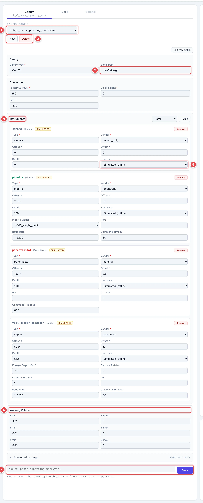
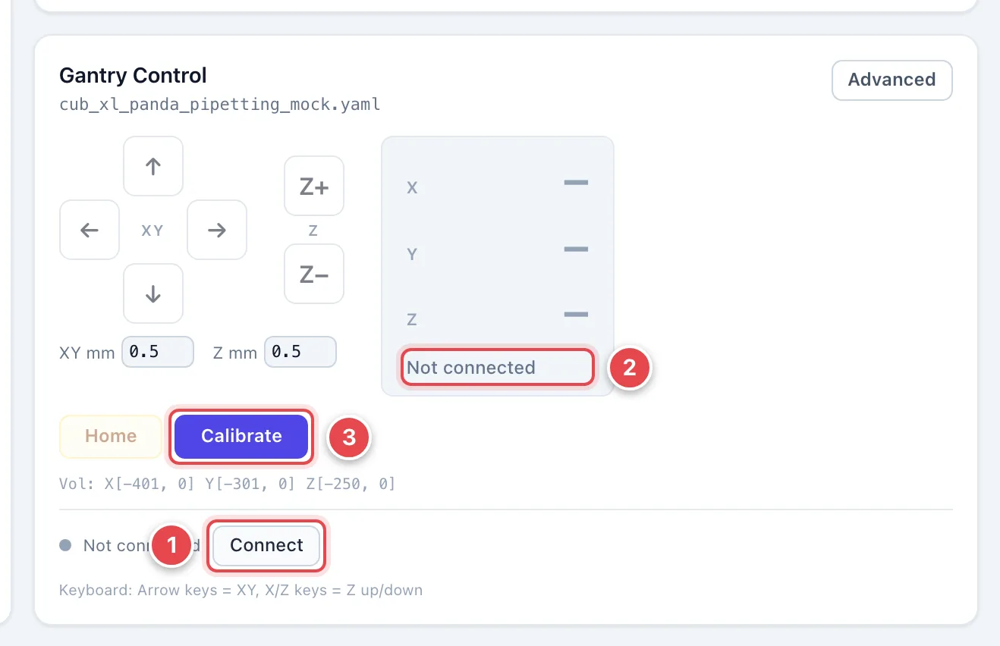
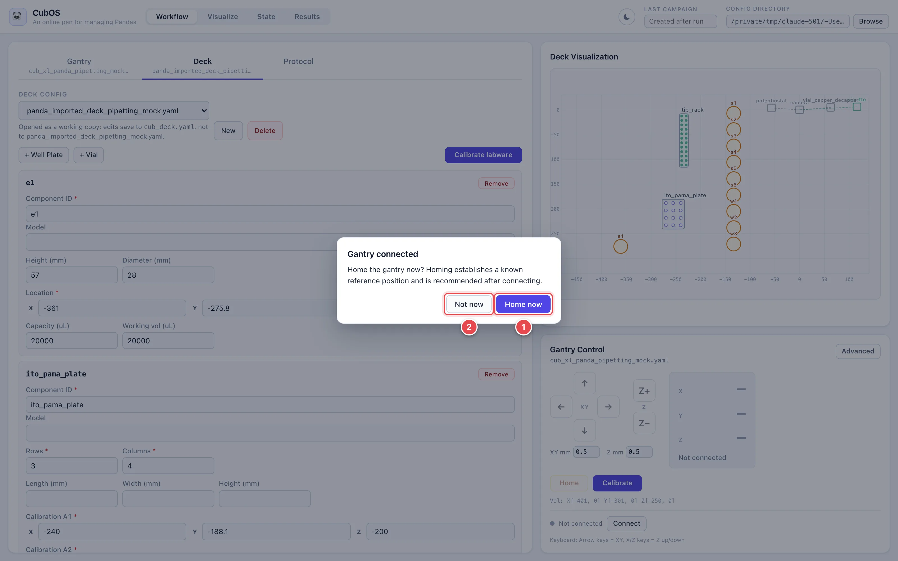
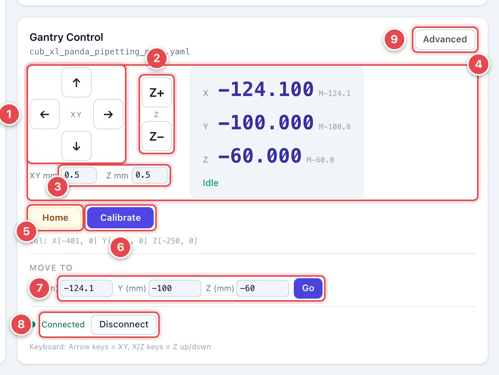

# Gantry: Connect and Move

This page covers the first things you do in every session: load the machine
config, connect to the gantry, home it, and move it by hand.

## Load the Gantry Config

Open the **Workflow** view and the **Gantry** tab.

1. **Gantry config.** Open your lab's calibrated machine file. Seed files
   are starting templates and need setup and calibration.
2. **New / Delete.** Create a draft or delete the open file. Delete is
   unavailable while connected.
3. **Serial port.** Leave blank to scan automatically, or enter your port
   (`COM3` on Windows, `/dev/ttyUSB0` on Linux, for example).
4. **Instruments.** Mounted tools and their settings. Use **+ Add** to add one.
5. **Hardware.** **Connected** uses the instrument; **Simulated (offline)**
   returns example data. **The gantry can still move with simulated instruments.**
   Use **Validate** to check a setup without motion.
6. **Working Volume.** Allowed travel range; it cannot detect misplaced labware or loose objects.
7. **Save.** Writes the selected file. Enter another filename to save a copy.

For what every field means, see [Set Up Gantry YAML](../gantry-setup.md).

## Connect and Home

!!! warning
    Homing and jogging move real hardware. Before you connect, clear loose
    items from the deck, check that cables and fixtures are out of the
    travel path, and keep the E-stop within reach.

Make sure the gantry is powered on and its USB cable is plugged into this
computer, and close Candle, Universal Gcode Sender, or any other program
that talks to the gantry — only one program can hold the serial port at a
time.

{ width="560" }

1. **Connect.** Opens the serial port named in the gantry config (or scans
   for one). The button reads **Select config first** until a gantry file is
   loaded.
2. **Not connected.** The readout shows dashes instead of coordinates until
   the connection is up.
3. **Calibrate.** Opens the calibration wizard, covered on
   [Calibrate the Gantry](calibrate-gantry.md).

As soon as the connection is up, the UI asks whether to home:

1. **Home now.** Drives each axis to its end stops to establish a known
   reference position. Always home after connecting.
2. **Not now.** Skips homing for now. You can home later with the **Home**
   button in Gantry Control.

Once homing finishes the status dot turns green with **Connected**, the
readout shows real coordinates, and the status line reads **Idle**.

## Move the Gantry

With the gantry connected and homed, use the buttons, keyboard, or **Move To**.
Raise the tool clear of labware before moving sideways.

{ width="560" }

1. **XY jog pad.** Click for one step, or hold to repeat. **→** moves
   right (+X); **↑** moves away from you (+Y).
2. **Z jog.** **Z+** raises the head; **Z−** lowers it.
3. **Step sizes.** Distance per step in millimeters. Start with 0.1–0.5 mm
   near labware; increase for a clear long move, then reduce for the final approach.
4. **Position readout.** Current work coordinates; smaller numbers are
   machine coordinates. **Idle** means ready, **Jog/Run** means moving,
   and **ALARM** means the controller is locked.
5. **Home.** Re-homes all axes; clear the path first.
6. **Calibrate.** Opens the [calibration wizard](calibrate-gantry.md).
7. **Move To.** Enter X/Y/Z and click **Go**. Moves the **head**, not a
   selected instrument tip. Do not copy a well position here when the tool
   has an offset. Out-of-range targets are refused.
8. **Connection.** Shows status and **Disconnect**.
9. **Advanced.** Controller settings, hold/resume, jog cancel, reset, and
   alarm controls. Use with the [recovery guide](../troubleshooting.md).

**Keyboard:** click outside a text field, then use arrows for X/Y, `X` for
Z up, and `Z` for Z down. The same step sizes apply.

## If Movement Is Blocked

| Message | What to do |
|---|---|
| **ALARM** after a limit-switch trip | Check the machine. If shown, **Pull off limit** backs away from the last jog direction. Otherwise **Unlock ($X)** clears the lock; use small jogs away from the switch, then re-home when the path is clear. |
| **HOLD** | Motion is paused. Check the path before **Resume**; it can continue held motion. |
| **CALIBRATION INTERRUPTED** | Click **Restore soft limits**. If restoration fails, reconnect before running a protocol. |
| **Protocol running — manual control locked** | Wait for the run to finish, or cancel it in the header or Run view. |

For an E-stop, collision, or an unexplained alarm, follow
[Troubleshooting & Recovery](../troubleshooting.md) before resuming.
