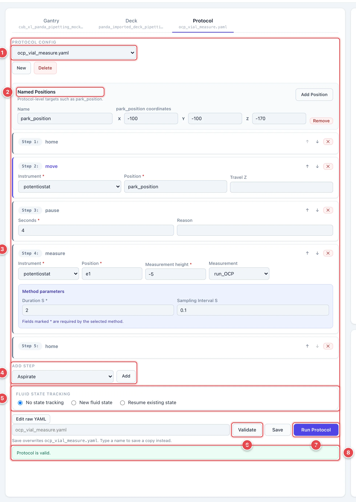
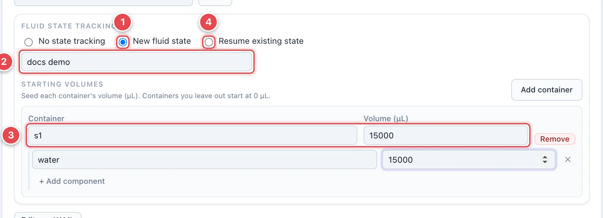
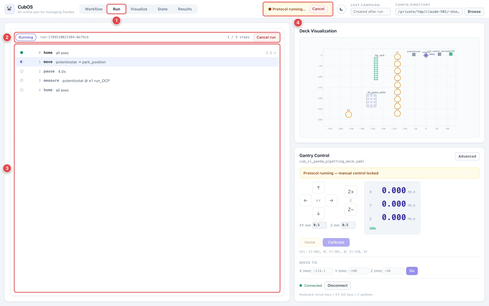
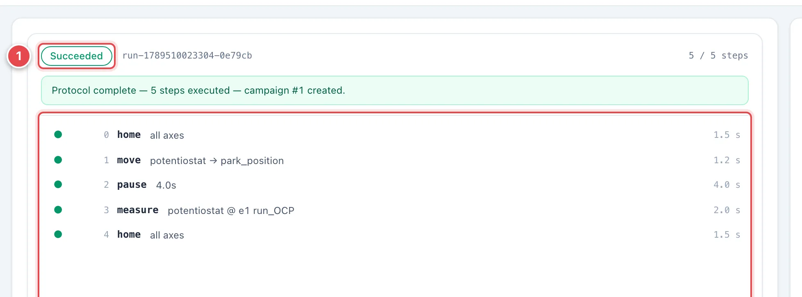

# Protocols

A protocol is a list of steps — home, move, measure, pipette, pause — that
CubOS executes against the loaded gantry and deck. This page shows how to
build one in the **Protocol** tab, validate it without moving anything, run
it, and watch it progress.

The **Protocol** tab unlocks once a saved gantry and deck are loaded.
Running also needs the gantry connected. Start with a protocol supplied
by your lab, or use **New** to build one.

## The Protocol Tab

1. **Protocol config.** Open a file or click **New**.
2. **Named Positions.** Optional XYZ targets, such as a park position.
3. **Step cards.** Steps in run order. Fill required fields marked `*`;
   arrows reorder steps and **×** removes one.
4. **Add step.** Choose a command and click **Add**. Use deck IDs for
   targets (`plate.A1`) or a supported named position.
5. **Fluid state tracking.** Choose how to record liquid, tips, and caps below.
6. **Validate.** Checks the saved files without motion: targets, travel
   limits, instrument methods, and command settings. It cannot check the bench.
7. **Run Protocol.** Save all three files, validate, fix errors, then run.
   Unsaved changes prevent starting.
8. **Validation result.** Green means valid; red explains what to fix.

**Edit raw YAML** above the save row opens the file as text, for anything
the form does not expose. See
[Run a Protocol with YAML](../protocol-yaml.md) for the full command
reference.

## Choose Steps and Heights

| Step | What it does |
|---|---|
| **Home** / **Move** | Establish the machine reference or move to a target. |
| **Measure** / **Scan** | Measure one target or every well of a plate with an instrument. |
| Pipette steps | Pick up/drop a tip, transfer liquid, mix, or perform supported liquid-handling tasks. |
| **Pause** | Wait for the configured time. |

The available commands and instrument methods appear in the form.
See [Protocol commands](../protocol-yaml.md#protocol-command-reference) for details.

**Measurement height** is measured from the labware's calibrated surface:
`0` is at the surface, `+2` is 2 mm above it, and `−2` is 2 mm below it.
**Interwell scan height** is the clearance above that surface between wells;
it must be at least the measurement height. Both must fit the machine's
travel limits. Named XYZ positions and **Travel Z** use deck coordinates
instead. Use your lab's tested heights when approaching a sample.

## Track Liquid State Across Runs

Pipetting protocols can keep a durable record of what is in every container,
which tips have been used, and which vials are capped. Pick a mode under
**Fluid state tracking** before running.

1. **New fluid state.** Start a fresh record for this run.
2. **Label.** An optional name for the new state so you can find it later.
3. **Starting volumes.** Enter the actual starting liquid in each nonempty container: its
   Component ID and volume in µL, optionally broken down by component.
   Containers you leave out start at 0 µL. CubOS checks starting amounts and blocks invalid transfers;
   verify the real liquid levels before running.
4. **Resume existing state.** Continue from a state saved by an earlier
   run, so volumes and consumed tips carry over.

The **State** view provides shortcuts to these two choices. It opens the
Protocol tab without starting a run. A state with pending or uncertain
operations cannot be resumed; choose **Start new state** instead.

**No state tracking** keeps no durable liquid or tip record. Used tips may
be selected again on the next run; replace or refresh the physical rack
before reusing a protocol in this mode. See
[Fluid State Tracking](../fluid-state.md) for how the record is stored and
resumed.

## Run and Watch

Click **Run Protocol**. The UI switches to the **Run** view, which stays
available for the rest of the session so you can come back to it.

1. **Run tab.** Return here to watch the run.
2. **Run header.** Status, run ID, step count, and **Cancel run**.
3. **Step list.** Completed, active, and pending steps. Finished steps show
   duration; failed steps show their error.
4. **Protocol running banner.** Visible in every view, with **Cancel**.
   Manual movement is locked during the run.

**Cancel run** requests a motion hold and cancellation. Wait for the final
status; an instrument action may still need to finish or report an error.
Use the machine's emergency stop if immediate intervention is needed.
A pipette holding liquid does not dispense it automatically on abort.
Check the real tip, liquid, and cap state before resuming a tracked state.

1. **Outcome.** The state pill turns green on success, and the banner under
   it reports the step count and the campaign number that was created.
2. **Completed steps.** Every step with its duration.

When the run completes, its measurements appear in the **Results** view as
a new campaign, and any tracked liquid volumes are in the **State** view.
See [Results and State](results-and-state.md).
